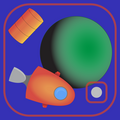

# Orbiter - iOS mobile game

In Orbiter, you are adrift in the cosmos. With your engines dead, you must use physics to your advantage: jettison heavy cargo barrels to alter your spacecraft's trajectory and navigate the stars!

Master orbital mechanics by calculating exactly when and where to throw your cargo. Shift your orbit to dodge deadly asteroids, moons, planets, and scorching stars. One wrong move means a catastrophic collision. Think fast, aim carefully, and survive the void. Good luck, Commander
